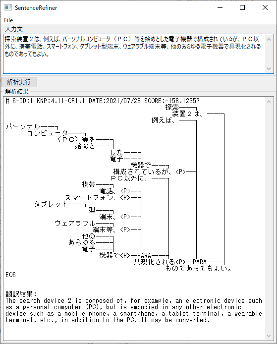
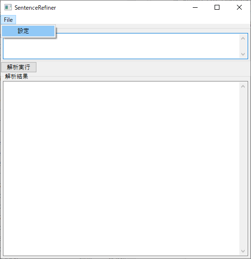
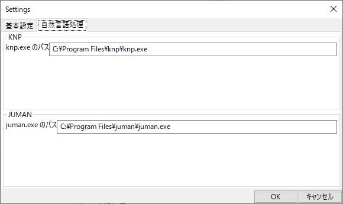

# Sentence Refiner

Sentence Refiner is a tool for refining text with case structure analysis and machine translation.




##  Quickstart

- install JUMAN (https://nlp.ist.i.kyoto-u.ac.jp/?JUMAN)

- install KNP (https://nlp.ist.i.kyoto-u.ac.jp/?KNP)
- (if necessary) create virtual environment

- `pip install -r requrirements.txt`
- (if necessary) create shortcut  ([How to create shortcut for running python script with specified VM](https://blog.colorfulwires.jp/entry/2021/03/04/shortcut-python-script-venv) )

## Usage

Run `main.py`:

```bash
python main.py
```



Change settings:



Input sentence and push `解析実行` button:


